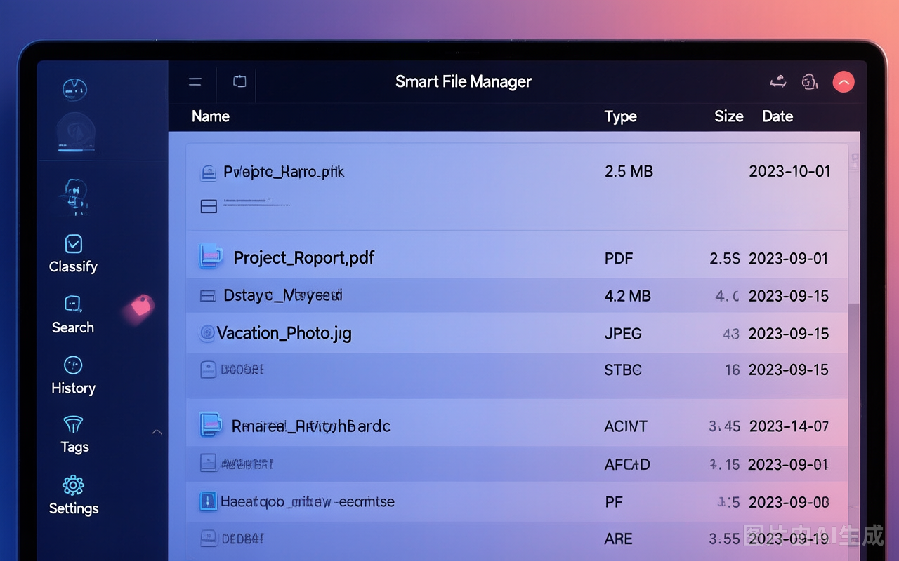
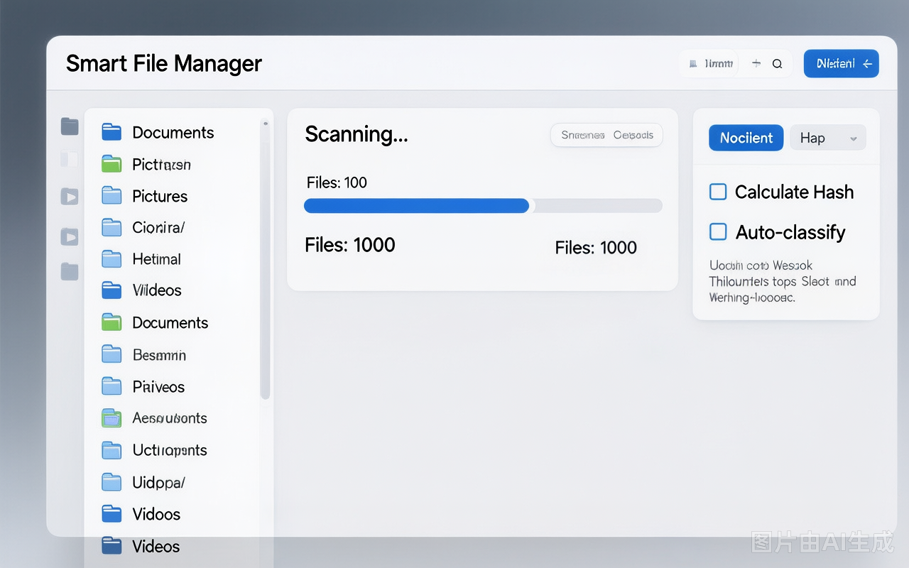
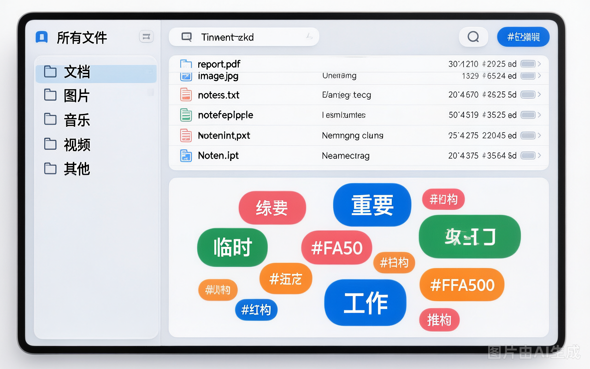

<p align="center">
  <h1 align="center">Smart File Manager</h1>
  <p align="center">智能文件管家 — 本地文件扫描、分类、搜索、标签管理工具</p>
</p>

<p align="center">
  
  
  
  
</p>

---

## 截图预览

<p align="center">
  
  <br>
  <em>主界面 - 左侧导航栏 / 文件列表 / 深色主题</em>
</p>

<p align="center">
  
  <br>
  <em>扫描管理 - 目录选择 / 进度显示 / 扫描选项</em>
</p>

<p align="center">
  
  <br>
  <em>分类与标签 - 分类树 / 标签云 / 文件关联</em>
</p>

---

## 目录

- [功能概述](#功能概述)
- [技术栈](#技术栈)
- [安装](#安装)
- [使用指南](#使用指南)
  - [扫描管理](#扫描管理)
  - [分类管理](#分类管理)
  - [文件搜索](#文件搜索)
  - [操作历史](#操作历史)
  - [标签管理](#标签管理)
  - [系统设置](#系统设置)
- [项目结构](#项目结构)
- [快捷键](#快捷键)
- [常见问题](#常见问题)
- [许可](#许可)

---

## 功能概述

- **文件扫描** — 递归扫描目录，支持增量扫描跳过已处理文件
- **智能分类** — 按文件类型、修改日期、关键词三维度自动归类
- **文件搜索** — 名称、类型、大小、日期、重复状态多条件检索
- **标签管理** — 独立标签系统，标签云可视化，自由创建和批量标记
- **操作撤销** — 自动记录操作历史，单条/批量撤销，Ctrl+Z 全局快捷键
- **双主题** — 深色/浅色主题一键切换，Catppuccin 配色方案
- **操作反馈** — 顶部 Toast 通知 + 底部状态栏双重反馈，不阻塞操作

## 技术栈

| 层 | 技术 |
|----|------|
| 前端 | PyQt6 |
| 数据库 | MySQL 5.7+ |
| 哈希去重 | SHA256 / MD5 |
| 回收站操作 | send2trash |
| 元数据提取 | Pillow, PyPDF2 |

## 安装

### 前置要求

- Python 3.9 或更高版本
- MySQL 5.7 或更高版本（默认本地 3306 端口）
- Windows 操作系统

### 步骤

```bash
# 1. 克隆仓库
git clone https://github.com/1371239533jkl/smart-file-manager.git
cd smart-file-manager

# 2. 安装依赖
pip install -r requirements.txt

# 3. 配置数据库密码
echo SMART_FM_DB_PASSWORD=你的MySQL密码 > .env

# 4. 启动
python main.py
```

> 首次启动时应用会自动创建数据库和全部数据表，无需手动执行 SQL。

### 配置说明

数据库密码通过 `.env` 文件配置（已加入 `.gitignore`），避免密码硬编码。

```ini
# .env
SMART_FM_DB_PASSWORD=你的MySQL密码
```

其他数据库连接参数可在 `config.py` 中修改。

---

## 使用指南

应用启动后显示左侧导航栏和右侧内容面板，共 6 个功能页面。

### 界面布局

```
┌─────────────────────────────────────────────────┐
│  Smart File Manager          [🌙 浅色]  v1.0    │
├──────┬──────────────────────────────────────────┤
│ 📂 扫描管理 │                                    │
│ 📁 分类管理 │           主内容面板                 │
│ 🔍 文件搜索 │                                    │
│ 📋 操作历史 │                                    │
│ 🏷️ 标签管理 │                                    │
│ ⚙️ 系统设置 │                                    │
├──────┴──────────────────────────────────────────┤
│  就绪                                            │
└─────────────────────────────────────────────────┘
```

---

### 扫描管理

扫描指定目录，将文件信息录入数据库。

| 操作 | 说明 |
|------|------|
| 选择目录 → **开始扫描** | 执行扫描，将文件信息存入数据库 |
| **计算文件哈希** | 勾选后为去重做准备（读取文件内容计算，大文件较慢） |
| **自动分类 / 提取元数据** | 勾选后扫描完成自动执行后处理 |
| **取消** | 中断正在进行的扫描任务 |
| 目录列表 → **删除** | 移除扫描配置（仅删除记录，不影响文件） |

> 对已扫描过的目录再次执行扫描时，只处理新增和修改的文件。

---

### 分类管理

左侧分类导航树，右侧显示对应文件。

**分类维度**：
- 按类型：图片 / 文档 / 视频 / 音频 / 压缩包
- 按日期：年-月
- 按关键词：工作 / 学习 / 生活 / 项目

**文件列表右键菜单**：

| 操作 | 功能 |
|------|------|
| 打开文件 | 系统默认程序打开 |
| 打开所在文件夹 | 资源管理器定位 |
| 复制路径 / 复制文件名 | 复制到剪贴板 |
| 重命名 | 修改硬盘文件名（需二次确认） |
| 标记删除 | 送回收站 + 数据库标记 |
| 永久删除 | 彻底从硬盘删除，不可撤销（双重确认） |

**批量操作**：多选文件后执行批量重命名或批量移动。

**重新分类**：手动触发全量重新分类。

---

### 文件搜索

按条件组合检索文件。

| 条件 | 说明 |
|------|------|
| 文件名 | 模糊匹配 |
| 类型 | 下拉选择文件分类 |
| 大小范围 | 最小值(KB) / 最大值(MB)，填 0 表示不限制 |
| 重复文件 | 全部 / 仅显示重复 / 仅显示不重复 |
| 修改时间 | 勾选后启用日期范围筛选（默认近 90 天） |

搜索结果通过分页浏览，每页 100 条。右键菜单同分类管理。

---

### 操作历史

自动记录所有文件操作，支持撤销。

| 方式 | 说明 |
|------|------|
| 单条撤销 | 点击操作行末的 **撤销** 按钮 |
| 批量撤销 | 多选操作记录后点击底部按钮 |
| 批次撤销 | 选中同一批次操作的记录，一键还原整批 |
| Ctrl+Z | 全局快捷键，触发当前页面撤销 |

> 永久删除和原路径已被占用的操作无法撤销。

---

### 标签管理

独立的标签系统，标签可与文件关联但独立存在。

| 操作 | 说明 |
|------|------|
| **新建标签** | 创建独立标签，不需要选中文件 |
| 标签云 → 点击 | 筛选该标签关联的文件 |
| **打标签** | 选中文件后输入标签名添加 |
| **移除标签** | 从选中文件中移除指定标签 |
| **删除标签** | 删除标签及其所有关联 |

标签云中标签的颜色和字体大小根据关联文件数量自动变化。

---

### 系统设置

左侧分类切换，右侧显示配置项。

| 分类 | 配置项 |
|------|--------|
| 通用 | 日志级别（附带各选项说明） |
| 扫描 | 递归、包含隐藏文件、哈希算法、大文件跳过阈值 |
| 重命名模板 | 自定义命名格式，实时预览效果 |
| 去重策略 | 保留最新/最旧/最短路径/手动选择 |

每个配置页支持单独保存和重置为默认值。

---

## 项目结构

```
smart-file-manager/
├── main.py                 # 应用入口
├── config.py               # 全局配置
├── init_database.sql       # 数据库建表脚本
├── requirements.txt        # 依赖清单
├── .env                    # 数据库密码（gitignored）
├── core/                   # 核心业务逻辑
│   ├── file_scanner.py     # 文件扫描
│   ├── file_classifier.py  # 智能分类
│   ├── file_manager.py     # 文件操作
│   ├── operation_history.py# 操作历史与撤销
│   ├── tag_manager.py      # 标签管理
│   └── dedup_manager.py    # 去重
├── ui/                     # 界面层
│   ├── main_window.py      # 主窗口
│   ├── scan_tab.py         # 扫描页面
│   ├── classify_tab.py     # 分类页面
│   ├── search_tab.py       # 搜索页面
│   ├── history_tab.py      # 历史页面
│   ├── tags_tab.py         # 标签页面
│   ├── settings_tab.py     # 设置页面
│   ├── styles.py           # 双主题样式
│   ├── toast.py            # 通知组件
│   ├── flow_layout.py      # 流式布局
│   └── theme_manager.py    # 主题管理
├── database/               # 数据访问层
│   ├── db_manager.py       # 数据库连接
│   └── models.py           # DAO 层
├── utils/                  # 工具函数
│   ├── logger.py           # 日志
│   ├── date_utils.py       # 日期处理
│   └── display_utils.py    # 格式化显示
└── tests/                  # 测试
    ├── test_display_utils.py
    ├── test_date_utils.py
    └── run_all_tests.py     # 一键运行全部测试
```

---

## 快捷键

| 快捷键 | 功能 |
|--------|------|
| `Ctrl+Z` | 执行当前页面的撤销操作 |

---

## 常见问题

**数据库连接失败？**
确认 MySQL 服务已运行，检查 `.env` 中的密码是否正确。

**扫描大目录速度慢？**
取消勾选"计算文件哈希"可显著提升速度。也可在设置中降低哈希计算的文件大小阈值。

**撤销操作失败？**
文件可能已被外部移动或删除，或原路径被其他文件占用。

**日志文件在哪？**
位于 `logs/app.log`，单文件最大 10MB，保留最近 5 个备份。

---

## 许可

本项目基于 MIT 许可证开源。详见 [LICENSE](LICENSE) 文件。
